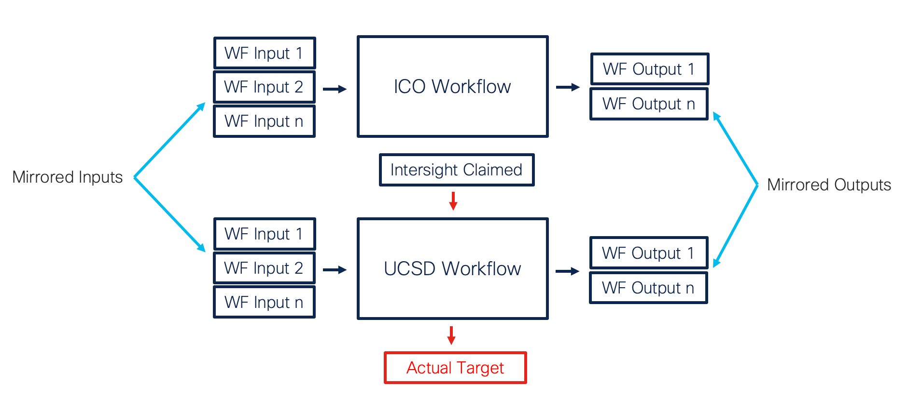
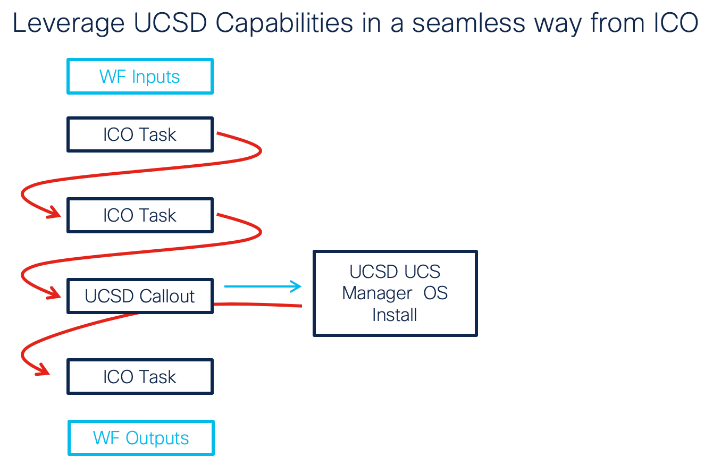
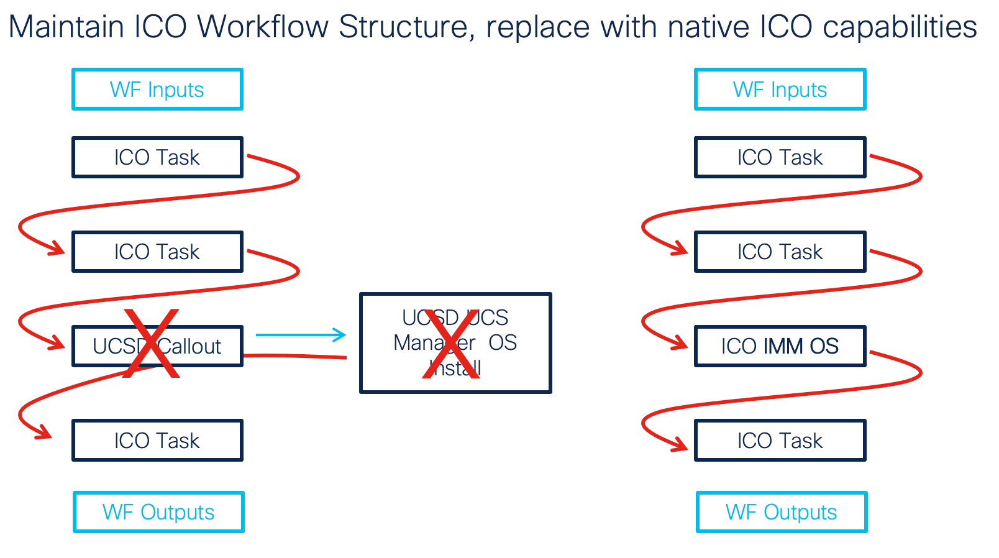

# UCS Director to Intersight Cloud Orchestrator
## Automatic Workflow Mirroring Tool
###### A tool written in Python to automatically generate ICO Workflows that mirror the UCS Director User Experience

DISCLAIMER: This is NOT an official Cisco repository and comes with NO WARRANTY AND/OR SUPPORT
Please check LICENSE-CISCO for additional details

## Goals
- Drive UCS Director automation from Intersight Cloud Orchestrator (single UI, single API, seamless user experience)
- One license (Intersight Premier) to be entitled to both orchestration tools
- TAC Supported end-to-end orchestration (as UCSD orchestration still happens in UCSD)
- Use UCS Director workflow outputs and inputs for ICO tasks and workflows
- Effortless and instant UCSD workflow callouts in ICO



Seamless user experience



Replace when it's the time with a native ICO task/workflow




## Requirements
- Intersight
	- [Licensed](https://intersight.com/help/saas/getting_started/licensing_requirements) Intersight account (Premier) or 90-days free trial
	- UCS Director is [claimed](https://intersight.com/help/saas/getting_started/claim_targets) and target is connected

- UCS Director
	- [Software](https://software.cisco.com/) version 6.8.3.0 or above
	- Valid REST API Access Key (Edit My Profile -> Show Advanced Settings

- Workstation
	- Python3
	- IP Connectivity to the UCSD Director Instance
	- Requirements installed on the main or in a [virtual environment](https://docs.python.org/3/tutorial/venv.html): <br>
	  `pip install -r requirements.txt`


## Usage 
This tool supports two execution modes:

1. Interactive (connects to UCSD and shows the list of workflows to be mirrored)
2. Non-Interactive (accepts a UCSD workflow name as parameter) 

You can invoke the help at anytime using the `-h` argument:

```
% python ucsd_to_ico.py -h
usage: python ucsd_to_ico.py [-h] -u UCSD -k KEY [-w WORKFLOW]

Mirrors UCS Director Workflows in Intersight Cloud Orchestrator
Returns a JSON file which can be imported in ICO.

rtortori@cisco.com

optional arguments:
  -h, --help            show this help message and exit
  -u UCSD, --ucsd UCSD  IP or FQDN of the Target UCSD Host
  -k KEY, --key KEY     UCSD API Key
  -w WORKFLOW, --workflow WORKFLOW
                        Name of the UCSD Workflow to Mirror

Example:
pip install -r requirements.txt

# Run in non-interactive mode (will return the JSON file to import in ICO):
python ucsd_to_ico.py -u 10.1.1.1 -k 052BF5DFD9204541D25DFBAC27CCE7FA -w "My Workflow" 

# Run in interactive mode (will present a menu from which you can select the target workflow to mirror):
python ucsd_to_ico.py -u 10.1.1.1 -k 052BF5DFD9204541D25DFBAC27CCE7FA
```

### Interactive Mode

Run the tool in Interactive mode if you want to fetch the list of UCSD workflows and pick from there.<br>
The tool will return the list of workflow inputs and outputs it's going to render in the ICO workflow based on what has found on UCS Director.

Example:

```
% python ucsd_to_ico.py -u ucsd.example.com -k A55BF2DFD910454FA2DDDBAC27CCE7EA

Initializing connection to UCSD ucsd.example.com

1 -- APIC Usecases (Topology Specific)
2 -- Bare Metal Workflows
3 -- Cisco UCS
4 -- CloudGenie
5 -- Container Usecases
6 -- Containers
7 -- EMC Unity
8 -- EMC VMAX
9 -- Examples
10 -- FlexPod
11 -- Generic Storage Tasks
12 -- Hyper-V
13 -- HyperFlex
14 -- IBM Storwize
15 -- L4-L7 Usecases
16 -- NetApp Storage Tenant Usecases
17 -- RHEV
18 -- Ric
19 -- System
20 -- Tenant Usecases
21 -- Utility
22 -- VMProvisioning
23 -- VMware
24 -- VNX Storage Tenant Usecases
Select Folder (0 to Exit): 3

Folder: Cisco UCS
1 -- Upgrade FW on Multiple UCS Rack Servers
2 -- Upgrade FW on UCS Infra
3 -- Upgrade FW on UCS Server
4 -- Upgrade FW on a Single UCS Rack Server
Select Workflow (0 to Exit): 4

Fetching Target workflow inputs and outputs for workflow: Upgrade FW on a Single UCS Rack Server

Workflow Inputs:
- Image profile
- CIMC server
- Timeout


Workflow Outputs:


No Outputs Retrieved, skipping Response Parser Generation

Exporting ICO Workflows and Tasks...
File exported: UpgradeFWonaSingleUCSRackServer-ucsd-to-ico.json
```

### Non Interactive Mode

Run the tool in Non-Interactive mode if you want to pass the UCSD workflow name as an argument.<br>
The tool will return the list of workflow inputs and outputs it's going to render in the ICO workflow based on what has found on UCS Director.

Example:

```
% python ucsd_to_ico.py -u ucsd.example.com -k A55BF2DFD910454FA2DDDBAC27CCE7EA -w "Provision ACI Customer Infra"

Initializing connection to UCSD ucsd.example.com


Fetching Target workflow inputs and outputs for workflow: Provision ACI Customer Infra

Workflow Inputs:
- Tenant Name
- Application Profile Name
- EPG Name


Workflow Outputs:
- APIC Device Tenant Identity
- APIC Device Tenant EPG Identity

Exporting ICO Workflows and Tasks...
File exported: ProvisionACICustomerInfra-ucsd-to-ico.json
```

## Import the Workflow in Intersight Cloud Orchestrator (ICO)

From Intersight Cloud Orchestrator, click on `Import`, then `Browse` to select the JSON file you just created with the script. Click `Import`, then `Close`.

You will now have an identical workflow in ICO with exactly the same inputs and outputs as the one present in UCS Director. 

After a successful execution, the workflow can also be rollbacked from ICO (all UCSD tasks will be rollbacked)

For additional details and open caveats/limitations check the [User Guide](./USER-GUIDE.md)
