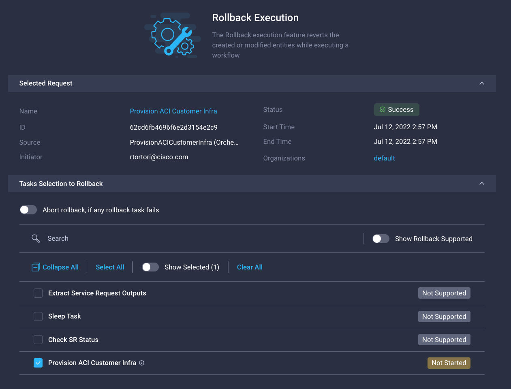

# UCS Director to Intersight Cloud Orchestrator
## Automatic Workflow Mirroring Tool
###### A tool written in Python to automatically generate ICO Workflows that mirror the UCS Director User Experience

## User Guide

Once you have generated the JSON file from the script, you need to import it in Intersight Cloud Orchestrator (ICO).

## Import

From Intersight Cloud Orchestrator, click on `Import`, then `Browse` to select the JSON file you just created with the script. 

You can optionally select an `Organization`. 
Click `Next`.

Intersight will display the list of objects that will be created:

- A rollback custom task to automatically rollback UCS Director Workflows
- A reusable custom task that represents the UCSD Workflow Callout (returns the SR name from UCSD)
- A workflow that uses the reusable custom task, checks the SR execution status and extracts UCSD workflow outputs mapping them to ICO workflow outputs 
- Two batch executors to abstract the API calls to UCS Director

Click `Import`.

Verify all objects validated.

Click `Close`.

## Use the imported Workflow

You can use the workflow in ICO in a standalone mode (execute the workflow) or in a larger workflow as a nested workflow.

### Standalone Execution

The workflow will have the same inputs as the UCSD counterpart.  
Additionally, you will need to select a UCSD target which will be the system actually executing the automation:

If the execution is succeeded, UCSD SR outputs will be mapped to ICO Workflow Outputs:

View from UCS Director for this workflow execution:

### Nested Workflow Execution

You can use the UCSD workflow mirror in ICO as part of a larger workflow.  
Mirrored UCSD workflows can be found under the `UCS Director Workflows` folder:

To leverage a mixed ICO and UCSD Worfklow, you can map ICO task outputs to UCSD Workflow Inputs and/or UCSD Workflow Outputs to ICO task inputs:

## Rollback Workflow Execution

Select a successful `Request` and click `Rollback`

Select `Rollback` again to confirm

UCSD View for Rollback

## Change Workflow Inputs and Outputs in UCS Director

There are cases when due to a change of business requirements, the UCS Director workflow inputs or outputs needs to be modified (i.e. add another mandatory input).

After the change on UCSD side, just re-run the script and import again selecting `Replace` when prompted. This will re-sync both workflows.  
Execution history will be preserved on ICO.

## Open Caveats and Limitations

- All ICO Workflow Inputs are strings
	- <b>Workaround:</b> manual pass after import to customize with appropriate data types if needed

- All ICO Workflows Inputs are mandatory
	- <b>Workaround:</b> manual pass to unflag as mandatory optional inputs

- Resulting ICO Workflow inputs value must be exactly one word (no spaces allowed as ICO reusable task input substitution will break the URL). 
	- <b>Workaround:</b> use %20 instead of spaces

- Rollback in ICO rollbacks the whole UCSD SR (you can't select what tasks to rollback for UCSD in the current implementation)
	- <b>Workaround:</b> rollback from UCSD if granular rollback is required 
